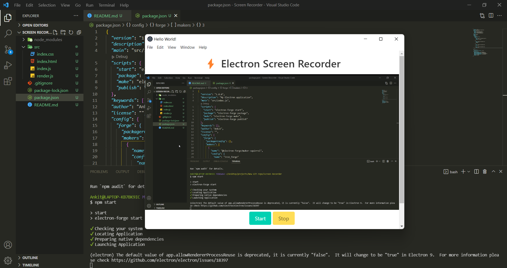

# Electron.js Screen Recorder

Build a screen recorder with Electron.js from scratch.



```
npm install

npm start

npm make  //package application and making platform specific distributables

```
